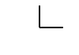

[](https://travis-ci.org/andrewcooke/Drawing.jl)

# Drawing

* [Introduction](#introduction)
* [Example](#example)
* [API](#api)
  * [Scopes](#scopes)
  * [Attributes](#attributes)
  * [Actions](#actions)
* [Raw Cairo](#raw-cairo)
* [Omissions / Future Work](#omissions--future-work)
* [Gallery](#gallery)

# Introduction

A library for drawing (diagrams, lines, shapes).

In other words: simple, imperative vector graphics; a wrapper around Cairo;
an interface similar to Processing.  For a declarative approach, see
[Compose.jl](https://github.com/dcjones/Compose.jl).  For more control and
complexity, use [Cairo.jl](https://github.com/JuliaLang/Cairo.jl) directly.

In providing a simple API, the package has two important aims:

1. Changes to the graphics context are *scoped*.  This is implemented via "do
   blocks".

2. Changes are *nested and composable*.  So, for example, you can define a
   context with certain attributes (ink colour, pen width, etc), and then have
   an inner scope that changes a subset of those values.

The design is somewhat experimental (how best to create scopes in Julia?), but
appears to work well.  The aim is to support a "reasonable subset" of Cairo's
functionality directly, while providing access to the "raw" Cairo librray if
needed.

# Example

```julia
with(File("red_blue_square.png"), Paper(100, 100), Ink("red"), Pen(0.1)) do
    draw(Ink("blue")) do
        move(0.0, 0.0)
        line(1.0, 0.0)
        line(1.0, 1.0)
    end
	draw() do  # the Ink is red here - the scope above has closed
		line(0.0, 1.0)
        line(0.0, 0.0)
	end
end
```


The default coordinate system is from 0 to 1 (on the shorter axis, origin
bottom left), with 10% of the space used as a border on each side.  Unlike
"raw" cairo, the "current point" is preserved across strokes.

# API

The API consists of:

1. **Scopes** introduce *attributes*, may include either nested *scopes* or
   *actions*, and may trigger some process (like stroking or filling a path)
   at the end.  For example, `draw()` is a scope that introduces attributes,
   includes actions, and triggers a stroke on closing.

2. **Attributes** modify the Cairo context for the duration of the scope.  For
   example, `Ink()` sets the Cairo source for the scope.

3. **Actions** typically describe a Cairo path.  For example, `move()` and
   `line()`.

These can be seen in the example above, which has three scopes, nested two
deep, and includes the attributes `Paper()`, `Ink()`, etc.

## Scopes

* `with()` defines a scope, but takes no action on closing.

* `draw()` defines a scope and, on closing, strokes the current path.

* `paint()` defines a scope and, on closing, fills the current path.

There are some constraints on how scopes are used:

* The `with()` scope cannot contain actions.

* The `draw()` and `paint()` scopes cannot contain nested scopes.

## Attributes

There are three kinds of attribute: bootstrap, output and state.

The order of bootstrap and output attributes is not important, but they can
only appear in the outermost scope.  The order of state attributes may be
important (eg the relative order of `Scale()` and `Translate()`) and follows
the order given in the scope, from left to right.

### Boot Attributes

`Paper(nx, ny; background="white", border=0.1, centred=false)` initialises a
Cairo context of the given size (in pixels).  Excluding the border (measured
as a fraction of the smallest side), the coordinate system is either bottom
left, or centred, and has is scaled so that the smallest axis has unit length.

Example axes (x is horizontal) for 70x100 pages, with a border of 0.1, where
the landscape axes are centred:




### Output Attributes

TODO

### State Attributes

TODO

## Actions

Currently, all actions affect the Cairo path.

TODO

# Raw Cairo

TODO

# Omissions / Future Work

* Implement all the things listed in the TODO list in the
  [source code](src/Drawing.jl).

* Multiple "pages" within a single scope will likely *not* be added.

# Gallery

TODO
