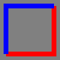
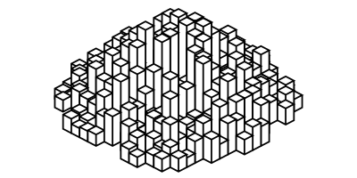

[](https://travis-ci.org/andrewcooke/Drawing.jl)

# Drawing

A library for drawing (diagrams, lines, shapes).

In other words: simple, imperative vector graphics; a wrapper around Cairo;
an interface similar to Processing.  For a declarative approach, see
[Compose.jl](https://github.com/dcjones/Compose.jl).  For more control and
complexity, use [Cairo.jl](https://github.com/JuliaLang/Cairo.jl) directly.

In providing a simple API, the package has two important aims:

1. Changes to the graphics context are *scoped*.  This is implemented via "do
   blocks".

2. Changes are *nested and composable*.  So, for example, you can define a
   context with certain attributes (ink colour, pen width, etc), and then have
   an inner scope that changes a subset of those values.

# Examples

```julia
with(File("red_blue_square.png"), Paper(100, 100), Ink("red"), Pen(0.1)) do
    draw(Ink("blue")) do
        move(0.0, 0.0)
        line(1.0, 0.0)
        line(1.0, 1.0)
    end
	draw() do  # the Ink is red here - the scope above has closed
		line(0.0, 1.0)
        line(0.0, 0.0)
	end
end
```



The default coordinate system is from 0 to 1 (on the shorter axis, origin
bottom left), with 10% of the space used as a border on each side.  Unlike
"raw" cairo, the "current point" is preserved across strokes.



This image was generated using the [towers.jl](test/towers.jl) script.  White
ink fill is used to "hide" background towers.
