[](https://travis-ci.org/andrewcooke/Drawing.jl)

# Drawing

* [Introduction](#introduction)
* [Examples](#examples)
* [API](#api)
  * [Scopes](#scopes)
  * [Attributes](#attributes)
  * [Actions](#actions)

# Introduction

A library for easy, extensible, drawing (diagrams, lines, shapes).

In other words: simple, imperative vector graphics; a wrapper around Cairo;
an interface similar to Processing.  For a declarative approach, see
[Compose.jl](https://github.com/dcjones/Compose.jl).  For more control and
complexity, use [Cairo.jl](https://github.com/JuliaLang/Cairo.jl) directly.

In providing a simple API, the package has two important aims:

1. Changes to the graphics context are *scoped*.  This is implemented via "do
   blocks".

2. Changes are *nested and composable*.  So, for example, you can define a
   context with certain attributes (ink colour, pen width, etc), and then have
   an inner scope that changes a subset of those values.

# Examples

```julia
julia> Pkg.add("Drawing")

julia> using Drawing

julia> with(Axes(centred=true), Pen(0.2)) do
		   paint(Ink("yellow")) do
			   circle(1)           # face background, painted yellow
		   end
		   draw() do
			   circle(1)           # face outline, drawn black (default)
			   circle(0.5; from=200deg, to=340deg)    # smile
		   end
		   paint() do
			   move(0.3, 0.25)     # right eye position
			   circle(0.2)         # paint eye
			   move(-0.3, 0.25)    # left eye position
			   circle(0.2)         # paint eye
		   end
	   end
Press RETURN to close window
```

which displays this window:

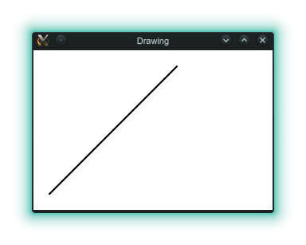

Pressing return and continuiing...

```julia
julia> r1, r2, r3, n, w = 1, 1, 0.5, 200, 0.5
julia> d1, d2, rotn = 120, -140, 40
julia> sat, val, alpha = 0.7, 0.5, 0.1
julia> side = 600

julia> width = 2*pi*r1 / n * w
julia> with(TK(side, side), 
		   Axes(centred=true),
		   Translate(0.9, 0.9), Scale(3),
		   Paper("black"),
		   Pen(width; cap="round")) do
		  for x in shuffle!([i / n for i in 1:n])
			  hue = x * 360
			  theta1 = deg2rad(rotn + x*360)
			  theta2 = theta1 + deg2rad(d1)
			  theta3 = theta1 + deg2rad(d2)
			  draw(Ink(HSVA(hue, sat, val + (1-val)*rand(), alpha))) do
				  move(r1 * cos(-theta1), r1  * sin(-theta1))
				  line(r2 * cos(-theta2), r2  * sin(-theta2))
				  move(r1 * cos(-theta1), r1  * sin(-theta1))
				  line(r3 * cos(-theta3), r3  * sin(-theta3))
			  end
		  end
	  end
Press RETURN to close window
```

displays

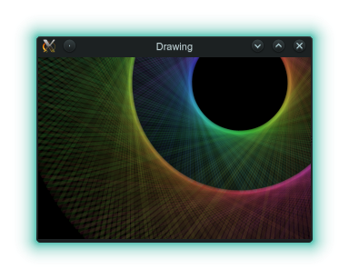

# API

The API consists of:

1. **Scopes** introduce *attributes*, may include either nested *scopes* or
   *actions*, and may trigger some process (like stroking or filling a path)
   at the end.  For example, `draw()` is a scope that introduces attributes,
   includes actions, and draws the path on closing.

2. **Attributes** modify the Cairo context for the duration of the scope.  For
   example, `Ink()` sets the Cairo source.

3. **Actions** typically describe a Cairo path.  For example, `move()` and
   `line()`.

These can be seen in the example below, which has three scopes, nested two
deep, and includes the attributes `Ink()`, `Pen()`, etc.

```julia
with(PNG("red-blue-square.png", 100, 100), Ink("red"), Pen(0.1)) do
    draw(Ink("blue")) do
        move(0, 0)
        line(1, 0)
        line(1, 1)
    end
	draw() do  # the Ink is red here - the scope above has closed
		line(0, 1)
        line(0, 0)
	end
end
```

[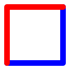](test/red-blue-square.jl)

The default coordinate system is from 0 to 1 (on the shorter axis, origin
bottom left), with 10% of the space used as a border on each side.  Unlike
"raw" cairo, the "current point" is preserved across strokes.

## Scopes

* `with()` defines a scope, but takes no action on closing.

* `draw()` defines a scope and, on closing, draws the current path.

* `paint()` defines a scope and, on closing, fills the current path.

* `cairo()` should be followed by a do block with a single argument, which is
  the cairo context.  This can then be used to make arbitrary calls to Cairo
  functions.

  For example:

  ```julia
  julia> using Drawing

  julia> using Cairo

  julia> cairo() do ctx
			line_to(ctx, 1, 1)
			stroke(ctx)
		 end
  Press RETURN to close window
  ```

There are some constraints on how scopes are used: the `with()` scope cannot
contain actions; the `draw()`, `paint()` and `cairo()` scopes cannot contain
nested scopes.

## Attributes

There are two kinds of attribute: initial and dynamic.

The order of initial attributes is not important, but they can only appear in
the outermost scope.  The order of dynamic attributes may be important (eg the
relative order of `Scale()` and `Translate()`) and follows the order given in
the scope, from left to right.

### Initial Attributes

* `PNG(path, width_px, height_px)` initializes a Cairo context and, at the end
  of the scope, writes a PNG format image, of the given size, to the given
  path.  Here width and height are measured in *pixels*.

* `PDF(path, width_mm, height_mm)` initializes a Cairo context and, at the end
  of the scope, writes a PDF format image, of the given size, to the given
  path.  Here width and height are measured in *mm*.

* `PDF(path; size="a4", orientation="landscape")` initializes a Cairo context
  and, at the end of the scope, writes a PDF format image, of the given size,
  to the given path.

* `TK(width_px, height_px; name="Drawing", destroy=true)` initializes a Cairo
  context associated with a Tk window, which is displayed at the end of the
  scope.  If `destroy=true` then the user is asked to press return, after which
  the window is destroyed; if it is false then there is no prompt and the
  window remains on the screen (until the window is closed by the user or
  julia exits).

* `Paper(background)` sets the background colour.

* `Axes(; scale=1, border=0.1, centred=false)` Sets the Cairo user
  coordinates.  Excluding the border (measured as a fraction of the smallest
  side), the coordinate system is either bottom left, or centred, and is
  scaled uniformly (assuming square pixels), so that the smallest axis has
  unit length.

  Below are plotted unit axes (x is horizontal) for 100x140 pixel images, with
  a border of 0.1 (ie 10 pixels), where the landscape axes are centred.  Note
  that drawing is not clipped to the unit axes area - it can extend over the
  whole page.

  [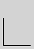](test/portrait.jl)
  [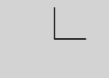](test/centred-landscape.jl)

  *Click on image to see associated script.*

### Dynamic Attributes

* `Ink(colour)` sets the Cairo source (ie the colour used to draw or paint).
  The colour can be a `Color` (see the Colors.jl package) or string ("red",
  "blue", etc).

* `Pen(width; cap=..., join=...)` sets the Cairo stroke properties (cap and
  join can be strings or constants from the Cairo.jl package).  Omitted values
  are unchanged.

  **Note:** pen width is in user units, but does not change if `Scale()` is
  used *afterwards*.

* `Pen(; cap=..., join=...)` as above, but allows width to be omitted (in
  which case the previous value is used).

  Below, example lines with cap/join (from left to right) of round/round,
  butt/mitre, square/bevel.
  
  [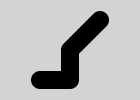](test/round-round.jl)
  [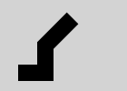](test/butt-mitre.jl)
  [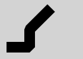](test/square-bevel.jl)

  *Click on image to see associated script.*

* `Scale(factor)` scales the Cairo user coordinates.  This is a relative
  correction - values smaller than one mean that the same shape (ie the same
  coordinates) displays a smaller result.

  **Note:** To scale the initial axes to have a range of 0-100, say, use
 `Scale(1/100)` (ie use the reciprocal of the range required).

* `Translate(x, y)` translates the Cairo user coordinates.  This is a relative
  correction - the same shape (ie the same coordinates) appear shifted by the
  given x and y offsets.

  [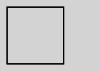](test/square.jl)
  [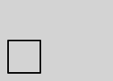](test/square-scale.jl)
  [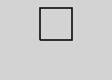](test/square-scale-translate.jl)

  *Click on image to see associated script.*

## Actions

Currently, all actions affect the Cairo path.

* `move(x, y)` moves the current point to given point in user coordinates.

* `line(x, y)` creates a straught line path between the current point and the
  given point, in user coordinates.

* `circle(radius; from=0, to=360)` create a circle centred at the current
  point, with a given radius.  Setting `from` and `to` to smaller angles
  creates an arc (incomplete circle, with angles measured anti-clockwise from
  the x axis, in degrees).

* `rectangle(width, height; align=1, rotate=0)` create a rectangle, rotated
  and placed relative to the current point using the "telephone pad" align (1
  is top left, 9 is bottom right).

* `square(side; align=1, rotate=0)` create a square, rotated and placed
  relative to the current point using the "telephone pad" align (1 is top
  left, 9 is bottom right).

* `text(s; align=1, rotate=0)` create the given text, rotated and placed
  relative to the current point using the "telephone pad" align (1 is top
  left, 9 is bottom right).

To clarify the `align` parameter, here are some text paths, align to the
nearest orange cross.

  [](test/text-align.jl)

*Click on image to see associated script.*
